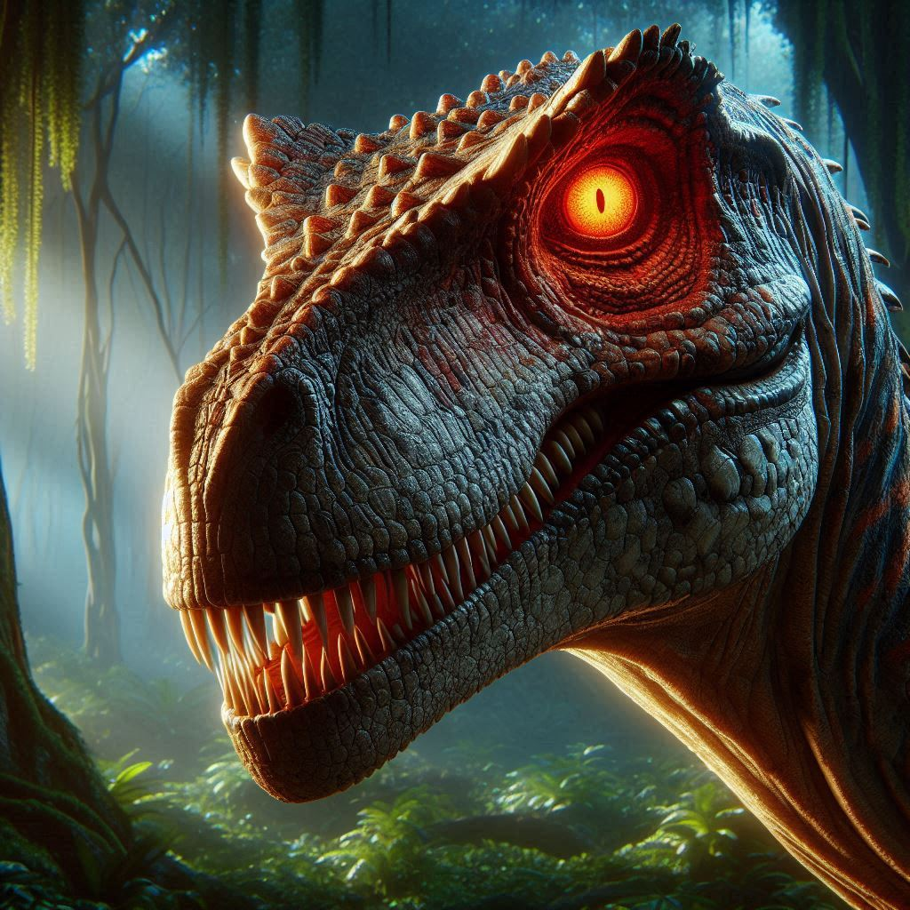

# Introducción al Proyecto

Este documento presenta una visión general del proyecto de desarrollo del videojuego 3D "Deforestation". En él se incluyen los aspectos clave de la historia, las características principales del juego y las instrucciones para comenzar a jugar. Además, se incluyen imágenes generadas con inteligencia artificial para ilustrar el mundo del juego.

# Lore

En una isla remota, un misterioso fenómeno ha alterado la vida tal y como la conocíamos. Durante siglos, extraños cristales sangrientos han estado ocultos en las torres esparcidas por toda la isla. Estos cristales, aparentemente inofensivos al principio, contienen un poder oscuro y antiguo capaz de reanimar a los dinosaurios que alguna vez caminaron sobre la Tierra.

Con el tiempo, los cristales comenzaron a emanar una energía peligrosa que desató un caos sin igual, trayendo consigo criaturas prehistóricas extremadamente agresivas. Los dinosaurios, ahora bajo el control de la energía de los cristales, atacan todo lo que se les cruce en su camino, sembrando terror por donde pasan.

Ahora, el jugador debe enfrentarse a esta amenaza. Debe destruir las torres que contienen los cristales sangrientos para evitar que el poder oscuro siga expandiéndose y siga generando más dinosaurios hostiles. En su camino, se enfrentará tanto a las bestias del pasado como a otros peligros que acechan en la isla.

# Características del juego

- **Exploración y supervivencia**: Muévete a través de escenarios hostiles mientras enfrentas a dinosaurios y otros peligros naturales.
- **Manejo de máquinas**: Controla una poderosa máquina equipada con armas y mejoras.
- **Combate y estrategia**: Enfréntate a dinosaurios y encuentra las torres de cristal sangriento.
- **Sistema de inventario y mejoras**: Recolecta recursos para usar en la máquina y avanza como puedas.
- **Sobrevive**: Intenta no morir al igual que defiendes a tu máquina, si destruyen la máquina también morirás.

# Instrucciones para comenzar

## Instalación

1. Descarga e instala el juego.

## Controles básicos

- **Movimiento**: W, A, S, D
- **Interacción**: E
- **Ataque**: Botón izquierdo del ratón
- **Cambio de modo máquina/humano**: ESC

## Objetivo inicial

Explora el terreno, recoge recursos y prepárate para enfrentar los peligros del mundo.

## Avanza y destruye las torres

Encuentra la forma de avanzar y localiza las torres con cristales sangrientos para ganar.

# Imágenes generadas con IA

